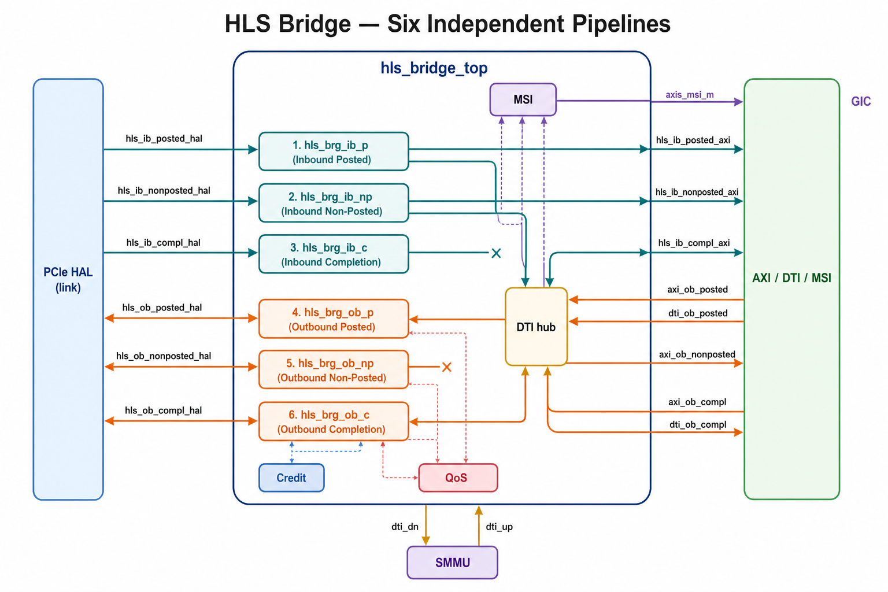
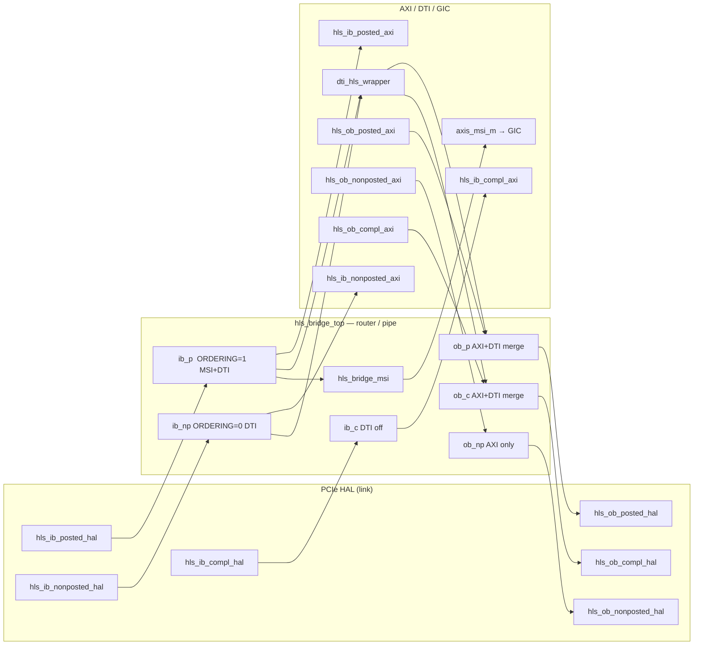
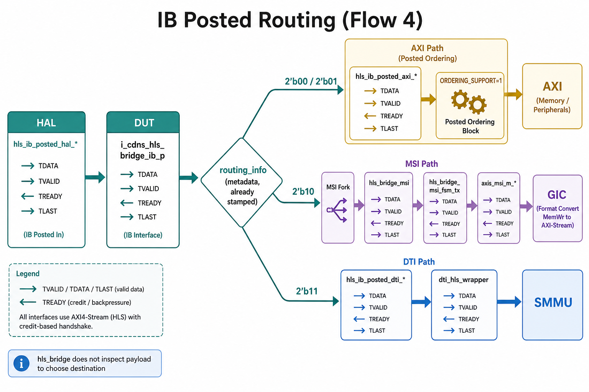
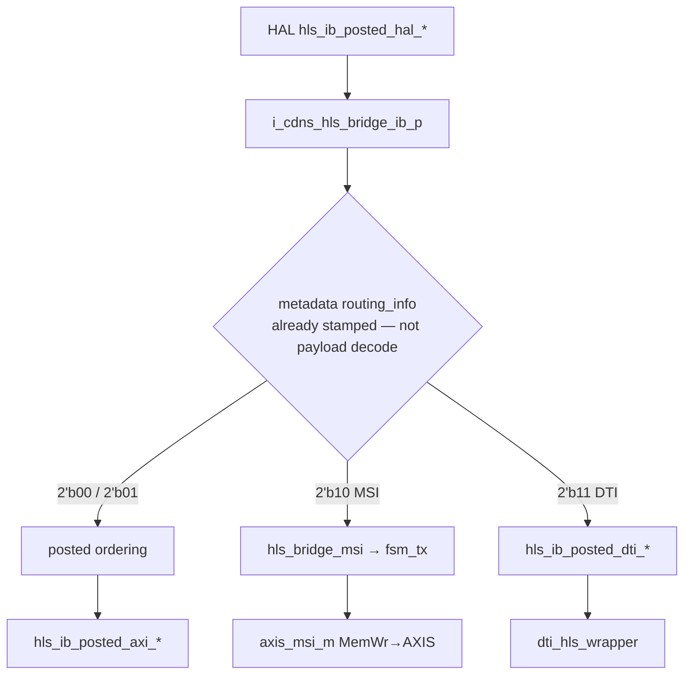
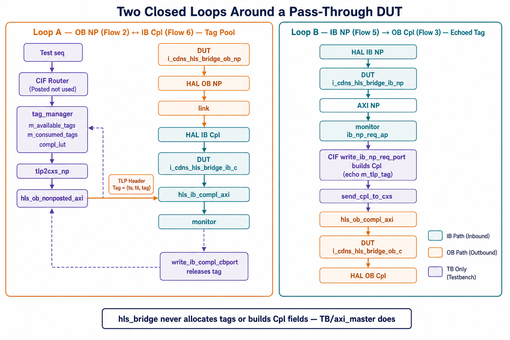

# Posted / Non-Posted / Completion Flow — Both Directions

`hls_bridge_top` instantiates **six independent pipelines** — one `hls_bridge_ib` or `hls_bridge_ob` instance per (traffic-class × direction) combination. Each has its own HAL-side and AXI/DTI/MSI-side interface and its own TB CXS agent.

This snapshot keeps the Cadence class names (`cdn_pcie_hpa_cif_tlp_router`, `cdn_pcie_hpa_tag_manager`, …) inside files named without the prefix (`cif_tlp_router.sv`, `tag_manager.sv`, `env.sv`, `monitor.sv`, `vseq.sv`). Sub-RTL (`hls_bridge_ob.v`, `hls_bridge_ib.v`, `hls_link_tx.v`, `dti_hls_wrapper.v`) is referenced from `hls_bridge_top.v` instantiations; those modules are not checked in here.

---

## Role of `hls_bridge` — protocol bridge / router, not a transaction processor

`hls_bridge` is a **format-conversion and routing layer** between the PCIe-link-facing HLS/CXS interface (HAL) and the AXI/DTI/MSI-facing HLS/CXS interfaces. It does not originate, terminate, or invent TLP content. Completions, tags, AXI5 channels, and interrupt semantics live on the other side of its boundary (`axi_bridge` / `axi_master`, GIC, or — in this module TB — CIF Router + tag manager).

One line: it is a traffic-class-aware (P/NP/C), destination-aware (AXI/DTI/MSI) credit-flow-controlled pipe. It converts formats, enforces posted ordering, and merges/splits streams. It is intentionally “dumb” at the transaction-semantics level, which is why module-level verification has to supply CIF Router, tag manager, and `tlp2cxs`.

```
  PCIe Core HAL          hls_bridge                 Neighbors (not this IP)
  (HLS CXS P/NP/C)   classify / route / align      axi_bridge / axi_master
         <---------------------------->            (AXI5 AW/AR/R/B, Cpl gen)
                     credit handshake              GIC (MSI AXIS consume)
                     P-P ordering (IB P only)      SMMU (DTI ATS)
                     AXI+DTI merge (OB)
                     MSI TLP → AXIS (format)
```

### What it does

| Function | Where it shows up in this tree | What it is not |
| --- | --- | --- |
| **1. Classify / route** | IB decoder uses metadata `hls_bridge_pkt_route_info` + `hls_bridge_port_info` (offsets `RX_METADATA_PKT_ROUTING_INFO_*` / `PORT_INFO_OFFSET` on each `hls_bridge_ib`). Monitor `predict_ib_pkt_routing` copies the same field: `00`/`01` AXI, `10` MSI, `11` DTI. The stamp comes from the producer (core / AXI-bridge / TB `tlp2cxs`), not from payload inspection inside the bridge. | Not BAR decode of TLP address as the primary mux (that is already in `routing_info` / `port_info`). |
| **2. Enforce PCIe posted ordering** | Only `i_cdns_hls_bridge_ib_p` has `ORDERING_SUPPORT=1`. IB NP and IB C set it to `0`. TB `ib_posted_order_checker.sv` `check_p_p_ordering` models fan-out to AXI/DTI/MSI queues; RO / `ro_en` / `vc_en` / `tc_en` relax AXI checks. | Not content generation. NP/C are not ordered by this block. |
| **3. Width / rate adapt** | ASF event maps in `hls_bridge_top.v`: AXI aligner, AXI gearbox, DTI aligner (IB); labeled AXI/DTI, gearbox packer/masker, main aligner (OB). `k_hls_dw_alignment` and `HLS_PORT_DATA_WIDTH_ARR` / `KMAX_DATAPATH_WD` (512 vs 1024). OB P/C merge AXI+DTI (`KMAX_DTI_SUPPORT`); OB NP does not. | Not TLP rebuild. Payload bits are shifted/packed, not reinterpreted. |
| **4. Credit flow control** | Every HLS port is `valid` / `data` / `cntl` / `crdgnt` / `crdrtn` / `activereq` / `activeack` / `deacthint`. Top comment: valid is asserted only when credits are available. `i_cdns_hls_bridge_credit` republishes posted/NP header+payload limits (`crd_m_lmt_*` / `crd_s_lmt_*`, plus DTI posted). `crd_lmt_if.sv` is that interface in the TB. | Not a transaction ACK (no SC/CA/UR, no BRESP). |
| **5. MSI local delivery (format convert)** | IB P only: `ib_posted_msi_*` → `i_cdns_hls_bridge_msi` (`msi.v`) → `hls_bridge_msi_fsm_tx` (`msi_fsm.v`) → `axis_msi_m_tvalid/tdata` to the GIC. `tvalid`/`tready` is the ack. QoS/DC sidebands (`qos_data`, `dc_data`) are stream IDs / counts, not interrupt policy. IB NP/C MSI ports are tied off. | Not GIC/SPI generation. MemWr MSI TLP → AXI-Stream beat. |
| **6. Forward pre-built completions** | `i_cdns_hls_bridge_ob_c` takes `hls_ob_compl_axi_*` (and DTI Cpl) already packed as HLS flits. IB C `hls_ib_compl_hal_cntl` documents `CPL_COMPLETE` and `CPL_ERROR_CODE` as **carried** fields (poison, byte-count mismatch, UR/CA, timeout, FLR) — the core/AXI master filled them. In SoC, `axi_master_rd_cpl_generator` (not in this snapshot) owns tag/SC/CA/UR/byte-count/lower-address. In **this module TB**, `cif_tlp_router.write_ib_np_req_port` / `send_cpl_to_cxs` does that job. | `hls_bridge_ob` does not compute Cpl status or byte count. |

QoS (`qos.v` / `i_cdns_hls_bridge_qos`) and delivered-count (`delivered.v`) only **aggregate** “a TLP left this port” counts toward HAL. They do not complete requests.

AXI-Lite on `hls_bridge_top` is CSR (MSI GIC cfg, debug order disable, packet counters), not the AXI5 data path.

### What it explicitly does not do

- **No tag CAM/LUT/pool** in the HLS bridge instances. Tags live in TLP headers. `tag_manager.sv` (`m_available_tags`, `m_consumed_tags`, `compl_lut`) is TB (and SoC AXI master), not `hls_bridge`.
- **No SC/CA/UR or byte-count generation.** CIF Router randomizes `temp_cpl_status` and copies `m_tlp_tag` from the NP request.
- **No AXI5.** No AWVALID/ARVALID/RDATA/BRESP on these six pipes — HLS CXS only. AXI protocol is `axi_bridge` / `axi_master` one level out (or CXS VIP in this TB).
- **No payload interpretation.** Routing is metadata `routing_info` + `port_info` (+ MSI fork on IB P). Decoder does not parse MemWr vs Cfg vs ATS from data beats to choose a destination.

### Who owns transaction semantics (module TB vs SoC)

| Semantic | SoC (outside this IP) | This HLS-bridge module TB |
| --- | --- | --- |
| Allocate/release NP tags | AXI master NP outstanding table | `tag_manager.generate_tag` / `write_ib_compl_cbport` |
| Build Cpl (status, BC, lower addr) | `axi_master_rd_cpl_generator` | `cif_tlp_router.write_ib_np_req_port` |
| Pack TLP → CXS flits | AXI HLS / HAL | `cdn_pcie_hpa_tlp2cxs_seq` |
| AXI5 read/write | `axi_bridge` / `axi_master` | CXS agents on `hls_*_axi_*` |
| Interrupt | GIC | AXIS MSI VIP + scoreboard |
| ATS | SMMU / DTI wrapper neighbor | DTI CXS envs when `KMAX_DTI_SUPPORT` |

That split is why Flows 2↔6 (tag pool) and 5↔3 (synthesized OB Cpl) are **TB/neighbor** loops around a pass-through DUT.

---

## Pictures of the flow

### System context and the six pipes





IB = HAL → DUT → client. OB = client → DUT → HAL. Posted IB can also leave as MSI AXIS or DTI; OB NP has no DTI.

### IB Posted destination fork (`routing_info`)





### Two closed loops (TB/neighbor semantics around a pass-through DUT)



**Loop A — OB NP (Flow 2) ↔ IB Cpl (Flow 6)** — tag allocated, then released:

```mermaid
sequenceDiagram
  autonumber
  participant SEQ as Test seq
  participant CIF as CIF Router
  participant TM as tag_manager
  participant CXS as tlp2cxs_np
  participant OBNP as DUT ob_np
  participant LINK as HAL / link
  participant IBC as DUT ib_c
  participant MON as Monitor

  SEQ->>CIF: NP TLP (no tag yet)
  CIF->>TM: ob_np_req_ap
  TM->>TM: pop m_available_tags, push m_consumed_tags, compl_lut
  TM->>CXS: gen_req  {t9,t8,tag} in TLP header
  CXS->>OBNP: hls_ob_nonposted_axi
  OBNP->>LINK: hls_ob_nonposted_hal  (forward only)
  LINK->>IBC: hls_ib_compl_hal
  IBC->>MON: hls_ib_compl_axi
  MON->>TM: ib_compl_req_ap
  TM->>TM: match tag, delete lut, push m_available_tags
```

**Loop B — IB NP (Flow 5) → OB Cpl (Flow 3)** — DUT does not complete; TB echoes the tag:

```mermaid
sequenceDiagram
  autonumber
  participant LINK as HAL / link
  participant IBNP as DUT ib_np
  participant MON as Monitor
  participant CIF as CIF Router
  participant CXS as tlp2cxs_compl
  participant OBC as DUT ob_c

  LINK->>IBNP: hls_ib_nonposted_hal
  IBNP->>MON: hls_ib_nonposted_axi  (forward only)
  MON->>CIF: ib_np_req_ap
  CIF->>CIF: write_ib_np_req_port  echo m_tlp_tag, SC/CA/UR, BC
  CIF->>CXS: send_cpl_to_cxs
  CXS->>OBC: hls_ob_compl_axi
  OBC->>LINK: hls_ob_compl_hal  (forward only)
```

Posted Flows 1 and 4 never enter `tag_manager` (except UIO posted writes).

---

## Direction naming

| Term | Meaning |
| --- | --- |
| **OB** (outbound) | AXI/DTI(/MSI only on IB Posted) → PCIe HAL, toward the link |
| **IB** (inbound) | PCIe HAL → AXI/DTI/MSI, from the link |

```
 PIPE          HAL (3×1024)              AXI (P/NP/C, 512)
  |                 |                         |
  v                 v                         v
cdnpcie_core -- hls_bridge_top -- axi_multibridge
  PL/DLL/TL/HAL   ib_p / ib_np / ib_c      axi_bridge[n]
                  ob_p / ob_np / ob_c      AXI M / AXI S
                  msi, dti, qos, crd
```

---

## RTL instances in `hls_bridge_top.v`

All six are separate instances of the same generic modules, differentiated by port map and parameters.

| Flow | Instance | Module | Distinct parameters | HAL | AXI / DTI / MSI |
| --- | --- | --- | --- | --- | --- |
| IB Posted | `i_cdns_hls_bridge_ib_p` | `hls_bridge_ib` | `KMAX_MSI_IF_SUPPORT`, `ORDERING_SUPPORT=1` | `hls_ib_posted_hal_*` | `hls_ib_posted_axi_*`, `hls_ib_posted_dti_*`, `ib_posted_msi_*` → `hls_bridge_msi` → `axis_msi_m_*` |
| IB Non-Posted | `i_cdns_hls_bridge_ib_np` | `hls_bridge_ib` | `KMAX_MSI_IF_SUPPORT=0`, `ORDERING_SUPPORT=0` | `hls_ib_nonposted_hal_*` | `hls_ib_nonposted_axi_*`, `hls_ib_nonposted_dti_*`; MSI tied off |
| IB Completion | `i_cdns_hls_bridge_ib_c` | `hls_bridge_ib` | `KMAX_DTI_SUPPORT=0`, MSI/order off | `hls_ib_compl_hal_*` | `hls_ib_compl_axi_*`; DTI and MSI tied off |
| OB Posted | `i_cdns_hls_bridge_ob_p` | `hls_bridge_ob` | `KMAX_DTI_SUPPORT`, `PORT_SOURCE_LABELING=1` | `hls_ob_posted_hal_*` | `hls_ob_posted_axi_*`, `hls_ob_posted_dti_*` |
| OB Non-Posted | `i_cdns_hls_bridge_ob_np` | `hls_bridge_ob` | **`KMAX_DTI_SUPPORT=0`**, `PORT_SOURCE_LABELING=1` | `hls_ob_nonposted_hal_*` | `hls_ob_nonposted_axi_*`; DTI HLS tied to 0 |
| OB Completion | `i_cdns_hls_bridge_ob_c` | `hls_bridge_ob` | DTI enabled, `PORT_SOURCE_LABELING=0` | `hls_ob_compl_hal_*` | `hls_ob_compl_axi_*`, `hls_ob_compl_dti_*` |

There is **no OB non-posted DTI** (ATS Translation Requests use IB NP DTI; translation completions return on OB C DTI). ASF for OB NP has AXI-labeled and gearbox events only (`MAX_OB_NP_NUM_OF_ASF_IF = 5*NUM_HLS_PORTS`), not `labeled_dti`.

Credit on OB posted is a pass-through handshake (`valid`/`crdgnt`/`crdrtn`/`activereq`/`activeack`); posted traffic does not generate a completion.

---

## How a completion is generated for an NP request

**The DUT never builds a Completion TLP.** `hls_bridge_ib_np` only forwards the NP; `hls_bridge_ob_c` only forwards a Cpl that is already packed. Who *constructs* the Cpl depends on which NP it is:

| NP direction | Completer | Who builds the Cpl |
| --- | --- | --- |
| **IB NP** (HAL → AXI): remote read/cfg/io hitting this device | Completer = AXI-side client | **Module TB:** CIF Router `write_ib_np_req_port`. **SoC:** `axi_master_rd_cpl_generator` (not in this tree). |
| **OB NP** (AXI → HAL): this device's read going to the link | Completer = remote on the link | Remote / HAL VIP. CIF Router does **not** synthesize that Cpl. DUT `ib_c` forwards `hls_ib_compl_*`; `tag_manager.write_ib_compl_cbport` only **matches** the tag. |

### IB NP → OB Cpl (CIF Router is the completer in this TB)

```
HAL IB NP  →  DUT ib_np  →  hls_ib_nonposted_axi
                              monitor process_hls_ib_nonposted_axi_pkt_ended
                              ib_np_req_ap.write(tlp)     // skipped if link-down
                              env: connect → cif_router.ib_np_req_export
                              write_ib_np_req_port()      // BUILD the Cpl TLP
                              cpl_trans_q.push_back(...)
send_cpl_to_cxs() (bg)     →  tlp2cxs_compl_seq
                              hls_ob_compl_axi  →  DUT ob_c  →  HAL OB Cpl
```

`write_ib_np_req_port` (`cif_tlp_router.sv`) clones the NP, then:

1. **Echo identity from the NP** (not a new tag): `m_tlp_tag`, `m_tlp_t8`, `m_tlp_t9`, `m_tlp_14_bit_tagscale`, TC, Attr0, Requester ID. Completer ID comes from the BAR-hit `np_req_hit_dev_cfg` (or the NP’s completer ID for CFG).
2. **Fmt/type from NP class**
   - IOWr / CfgWr / DMWr → `Cpl`, length 0, byte_count 4, lower_addr 0
   - IORd / CfgRd → `CplD` length 1 (or `Cpl` if status ≠ SC); payload random or zeros
   - MRd / MRdLk → `CplD`; byte_count from length + FBE/LBE; lower_addr from address + first set FBE bit; optional **split** Cpls on 128 B RCB / MPS
   - UIOMRd → `UIORdCplD` / `UIORdCpl`
3. **Status** `temp_cpl_status`: default **SC**. If `m_enable_ob_ca_status`, randomize SC / CA / UR. Non-SC CplD is rewritten to `Cpl` with no data.
4. Pack bytes, update ECRC, **push `cpl_trans_q`**.
5. `send_cpl_to_cxs` pops FIFO order (`cpl_trans_id=0`), `tlp2cxs_compl_seq.start_item` onto `m_ob_cpl_tlp_sqr` → OB Cpl AXI CXS agent.

The DUT `ob_c` instance never sees the NP; it only sees the CXS Cpl flit.

### OB NP → IB Cpl (remote completer)

CIF Router’s posted/NP **stim** path (`tlp_router`) sends the NP through `tag_manager.gen_req` (allocates tag) onto `hls_ob_nonposted_axi`. Completions come back as HAL IB Cpl. No `write_ib_np_req_port` on that path.

---

## TB environments (one CXS env per pipeline)

`env.sv` builds six HAL CXS envs plus per-port AXI CXS envs:

- HAL: `m_hls_ob_posted_hal_env`, `m_hls_ob_nonposted_hal_env`, `m_hls_ob_compl_hal_env`, `m_hls_ib_posted_hal_env`, `m_hls_ib_nonposted_hal_env`, `m_hls_ib_compl_hal_env`
- AXI `[NUM_HLS_PORTS]`: `m_hls_ob_posted_axi_env`, `m_hls_ob_nonposted_axi_env`, `m_hls_ob_compl_axi_env`, `m_hls_ib_*_axi_env`

`env_config.sv` `set_hls_ob_posted_axi_cfg` / `set_hls_ob_nonposted_axi_cfg` / `set_hls_ob_compl_axi_cfg` (and the HAL/IB counterparts) bind those agents.

Active sequencers for **AXI-side inject** (module TB, DUT client = AXI):

| Traffic | Sequencer assignment (`env.sv` `connect_hls_ob_trans_env`) |
| --- | --- |
| OB Posted | `cif_router.m_ob_p_cxs_sqr[0][i]` ← `m_hls_ob_posted_axi_env[i].cxs_env.act_agent.sequencer` |
| OB Completion | `cif_router.m_ob_compl_cxs_sqr[0][i]` ← `m_hls_ob_compl_axi_env[i].cxs_env.act_agent.sequencer` |
| OB Non-Posted | `tag_manager.m_ob_np_cxs_sqr[0][i]` ← `m_hls_ob_nonposted_axi_env[i].cxs_env.act_agent.sequencer` (also 10/14-bit managers) |

`vseq.sv` starts background convert sequences on both trans-envs:

```
m_hls_ob_trans_env.cif_router.start_bg_seqs();
m_hls_ib_trans_env.cif_router.start_bg_seqs();
m_hls_ob_trans_env.tag_manager.start_bg_seqs();   // tlp2cxs_np_seq
```

---

## 1. OB Posted (AXI/DTI write → HAL Posted TLP)

```
Test seq → CIF Router tlp_router()
           Posted branch (tag_manager NOT touched)
   → cdn_pcie_hpa_tlp2cxs_seq  (p_cxs_sqr = m_ob_p_cxs_sqr)
        ↓  hls_ob_posted_axi_*  (and/or hls_ob_posted_dti_*)
RTL: i_cdns_hls_bridge_ob_p
   → realign / WRR merge of AXI+DTI, then HLS TX
        ↓
   hls_ob_posted_hal_valid/data/cntl  → PCIe HAL
```

**CIF Router (`cif_tlp_router.sv` `tlp_router`)**  
If `req.m_tlp_req_type == CDN_HPA_PCIE_TRANS_POSTED_REQ`: copy the TLP, map TC → CIF, then `cdn_pcie_hpa_tlp2cxs_seq_h[cif].start_item` / `finish_item` on `m_ob_p_tlp_sqr`. Side paths: INTX queues, MSI/MSI-X `hpa_pkt_msi_msix_q`, UIO posted writes to `ob_uio_p_req_ap` (UIO posted **does** use `uio_p_tag_manager` because UIOWrCpl needs a tag).

**TB files:** `cif_tlp_router.sv` (`tlp_router`), `env.sv` / `env_config.sv` (`set_hls_ob_posted_axi_cfg`), `monitor.sv` (`process_hls_ob_posted_hal_pkt_ended` scoreboards HAL CXS).  
**Response:** credit handshake only; no completion.

---

## 2. OB Non-Posted (AXI read request → HAL NP TLP)

```
Test seq → CIF Router tlp_router()  (non-posted else branch)
   → ob_np_req_ap / ob_10_bit_tag_np_req_ap / ob_14_bit_tag_np_req_ap
   → tag_manager.write_ob_np_req_cbport() → np_req_q
   → generate_tag() → gen_req()
        assigns {m_tlp_14_bit_tagscale, m_tlp_tagscale, m_tlp_tag} = l_tag
        {m_tlp_t9, m_tlp_t8} = m_tlp_tagscale
        generate_compl_lut_item(); pack_bytes; update ECRC
   → tlp2cxs_np_seq.start_item on m_ob_np_tlp_sqr
        ↓  hls_ob_nonposted_axi_*
RTL: i_cdns_hls_bridge_ob_np
        ↓
   hls_ob_nonposted_hal_* → PCIe HAL
```

**Tag is in the TLP header**, packed into the CXS payload — not in usercntl/metadata.

Pool selection (`tlp_router` non-posted path):

- 8-bit: `ob_np_req_ap` when 10/14-bit not enabled (or not yet initialized)
- 10-bit: `ob_10_bit_tag_np_req_ap` after `dev_init_for_10_bit_tag_done`
- 14-bit: `ob_14_bit_tag_np_req_ap` in flit mode after 14-bit init
- UIOMRd: random among enabled pools

`gen_req` pops from `m_available_tags` (or `< 32` if 8-bit and `!m_ext_tag_en`), pushes `l_tag` onto `m_consumed_tags`, and records the request in `compl_lut`.

**TB files:** `tag_manager.sv` (`generate_tag`, `gen_req`, `write_ob_np_req_cbport`), `cif_tlp_router.sv` (NP branch), `env.sv` (NP CXS sequencer cast).  
**RTL:** `i_cdns_hls_bridge_ob_np`; DTI tied off.

---

## 3. OB Completion (synthesized Cpl → HAL Completion TLP)

Triggered by **Flow 5** (IB NP seen on AXI/DTI). Same transaction, opposite direction.

```
monitor process_hls_ib_nonposted_axi_pkt_ended
   → ib_np_req_ap.write(tlp)
   → cif_router.write_ib_np_req_port()
        builds pcie_cpl_trans, echoes tag from NP:
          m_tlp_tag / m_tlp_t8 / m_tlp_t9 / m_tlp_14_bit_tagscale
        push cpl_trans_q
   → send_cpl_to_cxs() (bg from start_bg_seqs)
   → tlp2cxs_compl_seq.start_item on m_ob_cpl_tlp_sqr
        ↓  hls_ob_compl_axi_*  (and hls_ob_compl_dti_* for ATS Cpl)
RTL: i_cdns_hls_bridge_ob_c
        ↓
   hls_ob_compl_hal_* → PCIe HAL
```

Tag is **echoed from the NP request**, not allocated from a tag pool.

`write_ib_np_req_port` also fills completer ID, TC, Attr, PTH SPID/DPID swap, optional CA/UR status, split Cpl length vs RCB, IDE/OHC.

**TB files:** `cif_tlp_router.sv` (`write_ib_np_req_port`, `send_cpl_to_cxs`, `start_bg_seqs`), `vseq.sv` (`cif_router.start_bg_seqs()`), `env.sv` (`m_ob_compl_cxs_sqr` cast; `ib_np_req_ap.connect(cif_router.ib_np_req_export)`).

---

## 4. IB Posted (HAL Posted TLP → AXI/DTI/MSI)

```
RTL: hls_ib_posted_hal_*
   → i_cdns_hls_bridge_ib_p
   → decoder routing_info:
        2'b00 / 2'b01 → AXI   (01 = UIO)
        2'b10        → MSI
        2'b11        → DTI
   → posted ordering (ORDERING_SUPPORT=1)
        ├─ AXI → hls_ib_posted_axi_*
        ├─ DTI → hls_ib_posted_dti_* → dti_hls_wrapper (hls2rx_posted)
        └─ MSI → hls_bridge_msi → axis_msi_m_* (GIC)
```

**Monitor (`process_hls_ib_posted_hal_pkt_ended`):** convert CXS→TLP and usercntl→metadata, then `predict_ib_pkt_routing`:

```
hls_bridge_pkt_route_info:
  2'b00 → ROUTE_TO_AXI
  2'b01 → ROUTE_TO_AXI   // UIO
  2'b10 → ROUTE_TO_MSI
  2'b11 → ROUTE_TO_DTI
hls_bridge_port_info → hls_port_num
```

Expected CXS/AXI-Stream is pushed to the matching scoreboard; MSI also predicts delivered-count. `ib_posted_order_checker` consumes expected IB P plus actual AXI/DTI/MSI/DC (UIOMWr skipped). AXI receive path `process_hls_ib_posted_axi_pkt_ended` writes the scoreboard, posted DC AP, and UIOMWr → `ib_uio_p_req_ap` (completion via Flow 3-like UIOWrCpl).

**Response:** credit handshake; MSI uses AXI-Stream `tvalid`/`tready`.

---

## 5. IB Non-Posted (HAL NP TLP → AXI/DTI, synthesizes OB Completion)

```
RTL: hls_ib_nonposted_hal_*
   → i_cdns_hls_bridge_ib_np   (MSI tied off, ORDERING_SUPPORT=0)
   → decoder → AXI and/or DTI
        ↓ captured on AXI CXS
TB: process_hls_ib_nonposted_axi_pkt_ended
      write_received_tr
      ib_np_req_ap.write(...)   // unless link-down
      → cif_router.ib_np_req_export
      → Flow 3
```

HAL-side `process_hls_ib_nonposted_hal_pkt_ended` only predicts AXI vs DTI and scores expected CXS; it does **not** synthesize the completion. Completions are generated from the **AXI (or DTI) received** NP so the DUT has already forwarded the request.

RTL does not complete NP itself in this TB architecture.

---

## 6. IB Completion (HAL Cpl TLP → AXI, releases Flow 2 tag)

```
RTL: hls_ib_compl_hal_*
   → i_cdns_hls_bridge_ib_c   (DTI unused, KMAX_DTI_SUPPORT=0)
   → AXI only: hls_ib_compl_axi_*
        ↓
TB: process_hls_ib_compl_axi_pkt_ended
      write_received_tr
      route by tag width:
        UIOWrCpl            → ib_uio_p_compl_req_ap
        m_tlp_14_bit_tagscale → ib_14bit_compl_req_ap
        m_tlp_tagscale        → ib_10bit_compl_req_ap
        else                  → ib_compl_req_ap
      → tag_manager.write_ib_compl_cbport()
```

`write_ib_compl_cbport`:

1. `l_tag = {m_tlp_14_bit_tagscale, m_tlp_t9, m_tlp_t8, m_tlp_tag}`
2. Must be in `m_consumed_tags` (else unexpected Cpl, unless discarded)
3. Decrement `compl_lut[l_tag].m_req_length_bytes` (split Cpl / TR extra Cpl)
4. On last Cpl (`length==0` or non-SC / error / timeout) and `cpl_complete` (or link-side): `compl_lut.delete(l_tag)`, `m_consumed_tags.delete`, `m_available_tags.push_front(l_tag)`

Closes the loop with Flow 2.

`env.sv`: `m_env_mon.ib_compl_req_ap.connect(m_hls_ob_trans_env.tag_manager.ib_compl_cbport_export)` (plus 10/14-bit and UIO posted managers).

---

## Two closed loops

```
  AXI NP req (Flow 2)                         AXI Cpl (Flow 6)
       |                                            ^
       v                                            |
  tag_manager.gen_req  ---- tag in TLP ---->  HAL IB C
  m_available_tags \                        /
  m_consumed_tags   }  compl_lut[l_tag]    {
  compl_lut        /                        \
       |                                            |
       v                                            |
  HAL OB NP  ---- link ----  HAL IB Cpl -----------+


  HAL IB NP (Flow 5)                          HAL OB Cpl (Flow 3)
       |                                            ^
       v                                            |
  DUT ib_np ---- AXI NP ---- monitor ---- cif_router.write_ib_np_req_port
                                            echo tag, cpl_trans_q
                                            send_cpl_to_cxs
                                            DUT ob_c
```

Posted (Flows 1 and 4) never uses `tag_manager`, except **UIO posted writes**, which allocate from `uio_p_tag_manager` and complete with UIOWrCpl.

---

## IB routing_info (decoder / monitor)

Used on IB P/NP/C metadata (`hls_ib_p_np_meta_s` or `hls_ib_cpl_meta_s`):

| `hls_bridge_pkt_route_info` | Destination |
| --- | --- |
| `2'b00` | AXI |
| `2'b01` | AXI (UIO) |
| `2'b10` | MSI (IB Posted only; NP/C MSI ports tied off) |
| `2'b11` | DTI (IB P and IB NP; IB C DTI tied off) |

`hls_bridge_port_info` selects the AXI HLS port. Completions can also use tag-range splitting (`predict_ib_hls_port_num` + `misc_tag_management`).

---

## DTI vs AXI occupancy (when `KMAX_DTI_SUPPORT=1`)

| HLS channel | DTI wrapper | Used? |
| --- | --- | --- |
| IB Posted | `hls2rx_posted_*` | yes (Inv Cpl, PRI, …) |
| IB Non-Posted | `hls2rx_nonposted_*` | yes (Translation Request) |
| IB Completion | — | **no** (tied off in `i_cdns_hls_bridge_ib_c`) |
| OB Posted | `hls2tx_posted_*` | yes (Inv Req, PRG Response) |
| OB Non-Posted | — | **no** (`i_cdns_hls_bridge_ob_np` `KMAX_DTI_SUPPORT=0`) |
| OB Completion | `hls2tx_compl_*` | yes (Translation Completion) |

---

## File map

| Role | This repo | Cadence name (class / full TB) |
| --- | --- | --- |
| CIF router | `cif_tlp_router.sv` | `cdn_pcie_hpa_cif_tlp_router` |
| Tag manager | `tag_manager.sv` | `cdn_pcie_hpa_tag_manager` |
| HLS env | `env.sv`, `env_config.sv` | `cdn_pcie_hls_bridge_env*` |
| Monitor | `monitor.sv` | `cdn_pcie_hls_bridge_monitor` |
| Virtual seq | `vseq.sv` | `cdn_pcie_hls_bridge_vseq` |
| TLP item | `hpa_tlp.sv` | `cdn_hpa_pcie_tlp` |
| Top RTL | `hls_bridge_top.v` | six `i_cdns_hls_bridge_*` instances |
| CXS convert seq | referenced, not checked in | `cdn_pcie_hpa_tlp2cxs_seq` |
| Trans env | connections live in `env.sv` | `cdn_pcie_hpa_trans_env` (cif_router ↔ tag_manager `ob_np_req_ap`) |
| IB posted order | `ib_posted_order_checker.sv` | Flow 4 only |
| OB AXI merge predict | `ob_merge_prectictor.sv` | Flows 1–3 AXI+DTI merge |

`hls_bridge_ob.v` / `hls_bridge_ib.v` / `hls_link_tx.v` / `hls_bridge_ib_decoder.v` / `hls_bridge_ib_p_ordering.v` / `hls_bridge_ib_msi_logic.v` / `dti_hls_wrapper.v` are not in this tree; behavior above is from `hls_bridge_top.v` port maps and TB prediction.
