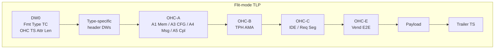
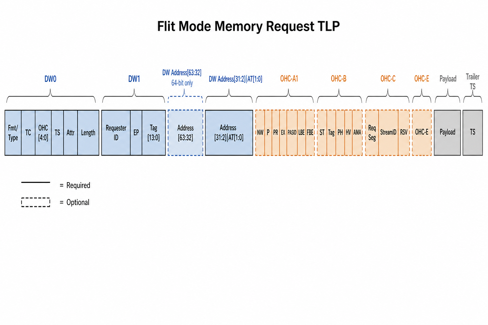
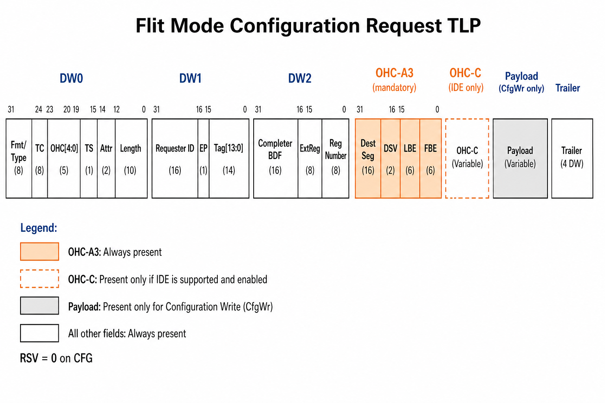
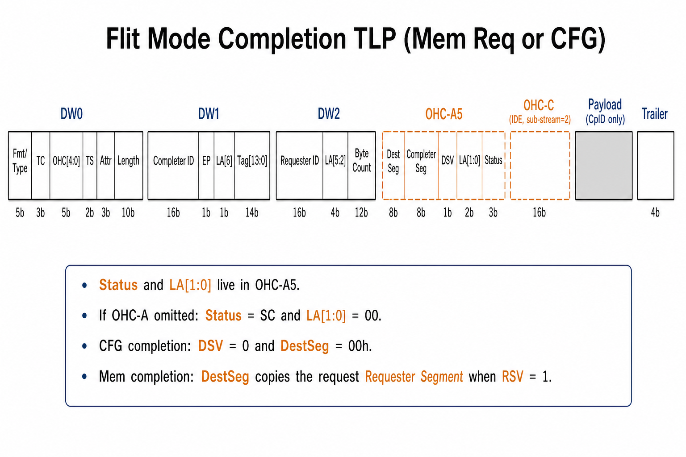
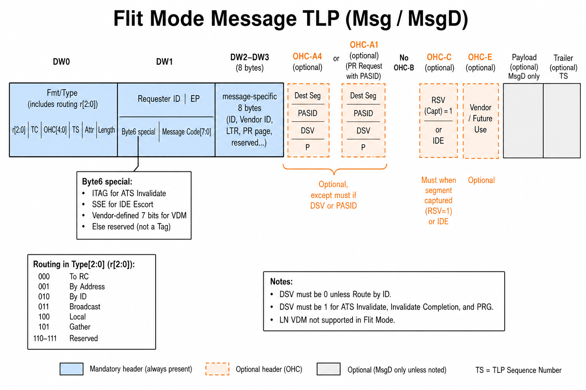
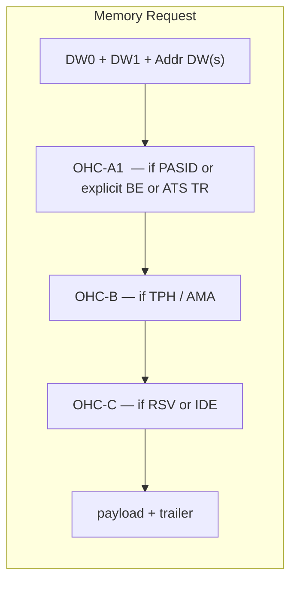
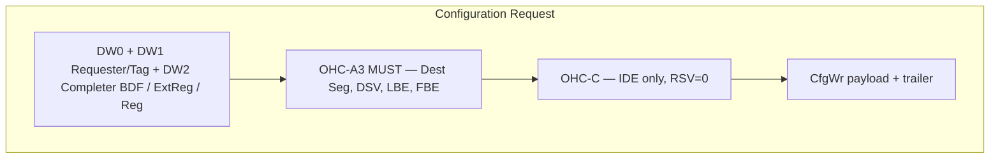
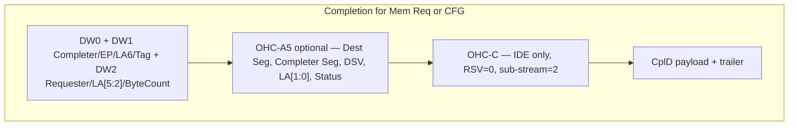
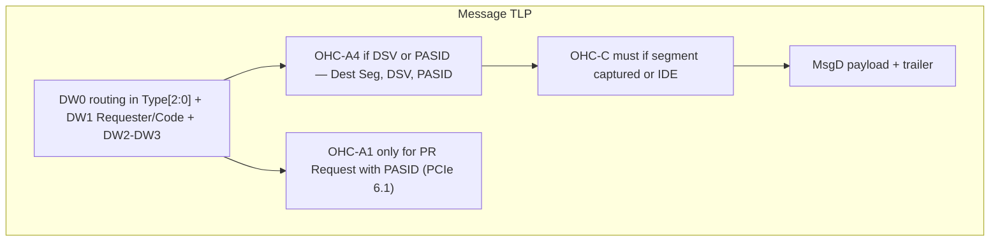

# Flit-mode TLP fields: Memory Request, Completion, CFG, and Message (with optional OHC)

PCIe 6.0 Flit Mode moves several Non-Flit header bits (TH, TD, LN, AT in DW0, FBE/LBE, Completion Status, BCM) into Orthogonal Header Content (OHC) DWs that follow the 3DW/4DW header. Presence of each OHC DW is advertised in the 5-bit **OHC** field of DW0.

Layouts below match `hpa_tlp.sv` pack/unpack (`do_pack` / `do_unpack` / `post_randomize`) and completion OHC-A5 rules in `cif_tlp_router.sv` / `tag_manager.sv`.

Bit 31 is the first bit transmitted in each DW (big-endian pack). Solid boxes are required. Dashed boxes are optional (OHC-A on Mem/Msg/Cpl, OHC-B/C/E, payload, trailer).

---

## Packet strip (diagrammatic)



OHC presence is selected by DW0 `OHC[4:0]`. Pack order is always **A then B then C then E**, skipping any DW whose presence bit is 0.

| OHC bits | Gate | Mem Req | CFG | MSG | Completion |
|---|---|---|---|---|---|
| [0] OHC-A | type-specific | optional A1 | **mandatory A3** | optional A4 (A1 for PR+PASID) | optional A5 |
| [1] OHC-B | TPH / AMA | optional | not used | **not used** | not used |
| [2] OHC-C | RSV or IDE | optional | IDE only (RSV=0) | **must if segment captured** (RSV=1) or IDE | IDE only (RSV=0) |
| [4:3] OHC-E | vend E2E | optional | **none** | optional | optional |









---


## 1. Common DW0 (all Flit-mode TLPs)

```
 31            24 23     21 20            16 15     13 12 11  10 9          0
+----------------+---------+----------------+---------+--+------+------------+
| Fmt[2:0]|Type[4:0] |  TC[2:0] |     OHC[4:0]     |  TS[2:0] |A2| Attr[1:0] | Length[9:0] |
+----------------+---------+----------------+---------+--+------+------------+
```

| Field | Bits | Notes |
|---|---|---|
| Fmt / Type | [31:24] | Same encodings as Non-Flit except Mem32 Type becomes `00011b` in Flit Mode (see `c_hdr_fmt_type`) |
| TC | [23:21] | Traffic Class |
| **OHC** | **[20:16]** | See OHC presence encoding below |
| TS | [15:13] | Trailer size: `000` none, `001` 1DW ECRC, IDE MAC/PCRC encodings for IDE |
| Attr[2] (IDO) | [12] | `m_tlp_attr1` |
| Attr[1:0] (RO/NS) | [11:10] | `m_tlp_attr0` |
| Length | [9:0] | DW count of payload (not including OHC or trailer) |

**OHC[4:0] presence (`m_ohc_hdr`):**

| OHC bits | Meaning |
|---|---|
| [4:3] | OHC-E size: `00` none, `01` 1DW, `10` 2DW, `11` 4DW |
| [2] | OHC-C present (IDE / requester segment) |
| [1] | OHC-B present (TPH / AMA) |
| [0] | OHC-A present (type-specific: A1 Mem, A3 CFG, A5 Cpl) |

OHC DWs, if present, are packed **after the last header DW**, in order **A then B then C then E**. Trailer (`m_ts_payload`) follows payload.

```
OHC[4:0]
  4  3  2  1  0
+--+--+--+--+--+
| E | E | C | B | A |
+--+--+--+--+--+
  |     |  |  |  +-- OHC-A 1DW  (A1 Mem / A3 CFG / A5 Cpl)
  |     |  |  +----- OHC-B 1DW  (TPH / AMA)
  |     |  +-------- OHC-C 1DW  (IDE / requester segment)
  +-----+----------- OHC-E 00=none  01=1DW  10=2DW  11=4DW
```

---

## 2. Memory Request (MRd / MWr / Atomic / DMWr)

Header is 3DW (32-bit address) or 4DW (64-bit address). **FBE/LBE are not in DW1.**

```
  +--------+--------+-------------------+--------+--------+--------+--------+--------+--------+
  |  DW0   |  DW1   | DW Addr[63:32] *  | AddrLo | OHC-A1 | OHC-B  | OHC-C  | OHC-E  | Payload| Trailer|
  | common | Req+Tag|   64-bit only     | AT[1:0]|  opt   |  opt   |  opt   |  opt   |  MWr   |  TS    |
  +--------+--------+-------------------+--------+--------+--------+--------+--------+--------+
       ^                  dashed = optional
```



### DW1 — Requester + Tag

```
 31                           16 15 14 13        8 7              0
+-------------------------------+--+--+-----------+----------------+
|         Requester ID          |EP|R | Tag[13:8] |    Tag[7:0]    |
+-------------------------------+--+--+-----------+----------------+
```

| Field | Bits |
|---|---|
| Requester ID (BDF) | [31:16] |
| EP | [15] |
| Rsvd | [14] |
| Tag[13:8] (`m_tlp_14_bit_tagscale`, T9, T8) | [13:8] |
| Tag[7:0] | [7:0] |

### Last address DW — Address + AT (replaces PH)

```
 31                              4 3  2 1  0
+----------------------------------+----+----+
|           Address[31:2]          | AT |
+----------------------------------+----+----+
```

- 64-bit Mem: extra DW with Address[63:32] before this DW.
- **AT[1:0]** lives here in Flit Mode (was DW0 in Non-Flit). PH is not in the header; it is in **OHC-B** when TPH is used.
- Translation Request + CXL: bit[3] can be `m_cxl_src` instead of Address[3].

### Optional OHC-A1 (Memory)

**When OHC-A is required**

- PASID present, **or**
- Explicit byte enables (`implcit_byte_enable_mem_tlps == 0`), **or**
- ATS Translation Request (NW flag is in OHC-A1)

**When OHC-A may be omitted**

- No PASID, not a Translation Request, and FBE=LBE=`4'hF` (implied). Unpack sets `implcit_byte_enable_mem_tlps` and forces FBE/LBE to `F`.

```
 31 30 29 28 27                    8 7    4 3    0
+--+--+--+--+-----------------------+------+------+
|NW|P |PR|EX|      PASID[19:0]      | LBE  | FBE  |
+--+--+--+--+-----------------------+------+------+
```

| Field | Bits | Notes |
|---|---|---|
| NW | [31] | No-Write; only for Translation Request. Else reserved (`m_ohc_a1_byte_0_field_7_rsvd`) |
| P | [30] | PASID TLP prefix present |
| PR / Exec | [29:28] | PASID prefix bits (valid if P=1) |
| PASID | [27:8] | 20-bit PASID (valid if P=1) |
| Last DW BE | [7:4] | |
| First DW BE | [3:0] | |

### Optional OHC-B (Memory only among these three types)

Present if TPH, extended TPH, or AMA is used.

```
 31              24 23               8 7  6 5  4 3   1 0
+------------------+------------------+----+----+-----+-+
|      Rsvd        |     ST Tag[15:0] | PH | HV | AMA |V|
+------------------+------------------+----+----+-----+-+
```

### Optional OHC-C (Memory)

Requester segment is **optional** on Memory Requests (RSV qualifies it). Must be present for IDE TLPs.

```
 31              24 23              16 15               8 7    4 3 2 1 0
+------------------+------------------+------------------+------+-+-+-+-+
| Requester Seg    | PR sent counter  |    Stream ID     | SubSt|R|r|K|T|
+------------------+------------------+------------------+------+-+-+-+-+
```

RSV is bit[3]. Non-IDE Sub-stream = `4'h7`. Completions use Sub-stream = 2.

- Segment not captured on the function: do not include OHC-C.
- Segment captured: OHC-C **may** be included on Mem requests.
- Non-IDE: Sub-stream must be `4'h7`.

CFG completions and Mem completions use OHC-C only for IDE (see below).

---

## 3. Configuration Request (CfgRd0/1, CfgWr0/1)

Always a 3DW header. **OHC-A3 is mandatory** (`m_ohc_hdr.ohc_a_present == 1`). OHC-E is not used on CFG (`ohc_ex_present == none`).

```
  +--------+--------+--------+--------+--------+--------+--------+
  |  DW0   |  DW1   |  DW2   | OHC-A3 | OHC-C  | Payload| Trailer|
  | common | Req+Tag| BDF+Reg|  MUST  | IDE only| CfgWr |  TS    |
  +--------+--------+--------+--------+--------+--------+--------+
```



### DW1 — same as Memory Request (Requester ID + EP + 14-bit Tag)

FBE/LBE are **not** in DW1; they are in OHC-A3.

### DW2 — target BDF + register number

```
 31                           16 15    12 11     8 7              2 1 0
+-------------------------------+--------+--------+----------------+---+
|     Completer ID (BDF)        |  Rsvd  | ExtReg |   Reg Number   | 00|
+-------------------------------+--------+--------+----------------+---+
```

Packed as: Bus[7:0], Dev[4:0], Fn[2:0], `cfg_byte_10_rsvd_field_7_4`[3:0], `m_tlp_ext_reg_num`[3:0], `m_tlp_reg_num`[7:0] (RegNum[1:0] reserved / DW aligned).

### Mandatory OHC-A3 (CFG)

```
 31              24 23              16 15 14           8 7    4 3    0
+------------------+------------------+--+-------------+------+------+
| Destination Seg  |      Rsvd         |DSV|   Rsvd     | LBE  | FBE  |
+------------------+------------------+--+-------------+------+------+
```

| Field | Bits | Rule |
|---|---|---|
| Destination Segment | [31:24] | Other device's segment; EP captures this as its requester segment |
| Byte1 Rsvd | [23:16] | `m_ohc_a3_byte_1_rsvd` |
| DSV | [15] | Must be 1 when segmentation is enabled; Destination Segment is qualified by DSV |
| Byte2 Rsvd | [14:8] | `m_ohc_a3_byte_2_rsvd` |
| LBE / FBE | [7:0] | CFG typically FBE=`4'hF`/`4'h1` and LBE=`0` |

If DSV=0, Destination Segment must be `00h`.

### Optional OHC-C on CFG

RSV (requester segment valid) **must be 0** on CFG (and on Completions). OHC-C appears on CFG only for **IDE** (Stream ID / K / T). Sub-stream is not `4'h7` when IDE.

---

## 4. Completion (Cpl / CplD) for Mem Req or CFG

Always a 3DW header in Flit Mode (no 4th header DW). **BCM is gone. Completion Status and LA[1:0] move to OHC-A5.**

```
  +--------+--------+--------+--------+--------+--------+--------+
  |  DW0   |  DW1   |  DW2   | OHC-A5 | OHC-C  | Payload| Trailer|
  | common | Cpl+Tag| Req+LA |  opt   | IDE    |  CplD  |  TS    |
  |        |  LA[6] | BC[11:0]|Status  | sub=2  |        |        |
  +--------+--------+--------+--------+--------+--------+--------+
                         LA[5:2]          LA[1:0]
```



### DW1 — Completer + Tag

```
 31                           16 15 14 13        8 7              0
+-------------------------------+--+--+-----------+----------------+
|         Completer ID          |EP|LA6| Tag[13:8]|    Tag[7:0]    |
+-------------------------------+--+--+-----------+----------------+
```

| Field | Bits |
|---|---|
| Completer ID | [31:16] |
| EP | [15] |
| Lower Address[6] | [14] |
| Tag[13:0] | [13:0] |

### DW2 — Requester + remaining address + byte count

```
 31                           16 15          12 11                 0
+-------------------------------+--------------+--------------------+
|         Requester ID          |  LA[5:2]     |   Byte Count[11:0] |
+-------------------------------+--------------+--------------------+
```

LA[1:0] are **not** here.

### Optional OHC-A5 (Completion)

```
 31              24 23              16 15 14        5 4  3 2      0
+------------------+------------------+--+-----------+----+--------+
| Destination Seg  | Completer Seg     |DSV|  Rsvd    |LA[1:0]| Status |
+------------------+------------------+--+-----------+----+--------+
```

| Field | Bits | Rule |
|---|---|---|
| Destination Segment | [31:24] | Qualified by DSV |
| Completer Segment | [23:16] | `00h` if Segment Captured is clear; else captured segment from first CfgWr |
| DSV | [15] | Destination Segment Valid |
| Rsvd | [14:5] | `m_ohc_a5_byte_2_3_rsvd` |
| Lower Address[1:0] | [4:3] | |
| Completion Status | [2:0] | SC / UR / CRS / CA |

**DSV / Destination Segment (completer rules):**

| Associated request | DSV | Destination Segment |
|---|---|---|
| Configuration Request | 0 | `00h` |
| NP Memory Request **without** Requester Segment (no OHC-C RSV) | 0 | `00h` |
| NP Memory Request **with** Requester Segment | 1 | copy request's Requester Segment |

**Must include OHC-A5 when any of:**

- Segment Captured is set **and** NP Mem Req requester segment does not match captured segment
- Lower Address[1:0] != `00b`
- Completion Status != Successful Completion

**Must not include OHC-A5 when all of:**

- Status = SC
- LA[1:0] = `00b`
- Segment Captured is clear

**Permitted to omit OHC-A5 when all of:**

- Status = SC
- LA[1:0] = `00b`
- Segment Captured is set
- Request had no requester segment, **or** requester segment matches captured segment

PCIe 6.1: OHC-A may still be sent with Dest Seg / DSV / status / LA[1:0] zeroed, Completer Segment still populated (`cif_tlp_router.sv`).

If OHC-A5 is omitted, Status is implied SC and LA[1:0] implied `00b`.

```mermaid
flowchart TD
  start[Build Completion] --> chk1{status != SC OR LA[1:0] != 00?}
  chk1 -->|yes| must[Must send OHC-A5]
  chk1 -->|no| cap{Segment Captured?}
  cap -->|clear| omit[Must omit OHC-A5]
  cap -->|set| mismatch{Mem Req RSV set AND ReqSeg != captured?}
  mismatch -->|yes| must
  mismatch -->|no| perm[May omit OHC-A5]
  start --> cfg{Associated request is CFG?}
  cfg -->|yes| dsv0[DSV=0 DestSeg=00h]
  cfg -->|no Mem| rsv{Request had RSV?}
  rsv -->|yes| dsv1[DSV=1 DestSeg=ReqSeg]
  rsv -->|no| dsv0
```

### Optional OHC-C on Completion

RSV is **reserved / 0** on IDE completions. OHC-C is included when the request had an IDE prefix (Stream ID and T copied from the NP request; Sub-stream = 2 for Completions). `populate_ide_fields()` forces `ohc_c_present = 1` in Flit Mode.

---

## 5. Message Request (Msg / MsgD)

Posted. Header is always **4DW**. Fmt is `001` (Msg) or `011` (MsgD). Type[4:3] = `10`. Type[2:0] is the **routing**. LN Vendor-Defined Messages are not generated in Flit Mode.

```
  +--------+--------+--------+--------+--------+--------+--------+--------+--------+
  |  DW0   |  DW1   |  DW2   |  DW3   | OHC-A  | OHC-C  | OHC-E  | Payload| Trailer|
  | common |Req+Code|  message-specific 8B     | A4/A1  |  must* |  opt   |  MsgD  |  TS    |
  +--------+--------+--------+--------+--------+--------+--------+--------+--------+
  * OHC-C must when segment captured (non-IDE RSV=1). OHC-B is not used on MSG.
```



### Routing in DW0 Type[2:0]

| Type[2:0] | Route | DSV in OHC-A4 |
|---|---|---|
| 000 | To RC | must be 0 |
| 001 | By Address | must be 0 |
| 010 | By ID | 1 if Dest Seg != Req Seg (must); permitted 1 if equal; **must 1** for ATS Invalidate, Invalidate Complete, PR Group Response |
| 011 | Broadcast from RC | must be 0 |
| 100 | Local / terminate at receiver | must be 0 |
| 101 | Gather to RC | must be 0 |

When DSV is 0, Destination Segment must be `00h`. Other-than-ID-routed messages may still carry OHC-A4 with DSV=0 and Dest Seg=0.

### DW1 — Requester + Message Code (no Tag)

Flit Mode does **not** put Tag in MSG DW1 (Non-Flit used byte 6 as Tag/`00`).

```
 31                           16 15 14                 8 7              0
+-------------------------------+--+--------------------+----------------+
|         Requester ID          |EP|     Byte 6         |  Msg Code[7:0] |
+-------------------------------+--+--------------------+----------------+
```

| Message | Byte 6 [14:8] |
|---|---|
| ATS Invalidate | Rsvd[6:5] + **ITAG[4:0]** |
| IDE Escort | field[6:2] + **SSE[1:0]** |
| VDM Type0/1 (PCIe 6.1) | **vendor_definition_vd_msg[6:0]** |
| All others | reserved (`second_dw_byte_6_msg_rsvd`) |

### DW2–DW3 — message-specific

Always packed as two DWs. If Route by ID, DW2[31:16] is Completer ID (except PR Request, which is address-routed).

| Msg Code | DW2–DW3 contents |
|---|---|
| Vendor Defined Type 0/1 | Completer ID (or Hierarchy ID) + Vendor ID + Vendor Msg DW |
| ATS Invalidate | Completer ID + reserved |
| ATS Invalidate Complete | Completer ID + Inv Cpl Count + ITAG vector |
| LTR | Completer ID if ID-routed + No-Snoop latency + Snoop latency |
| Page Request | Page address + Group Index + Last/Wr/Rd |
| PR Group Response | Completer ID + Response Code + Group Index |
| OBFF | Completer ID if ID-routed + OBFF code[3:0] |
| PTM RespD (MsgD) | Completer ID if ID-routed + Master Time |
| IDE Sync / Escort / Fail | Completer ID if ID-routed + stream / PR-sent counters |
| INTx / PME / ERR / Unlock / others | Completer ID if ID-routed, else reserved |

### Optional OHC-A4 (most Messages)

**Must** if DSV=1 or PASID present. **May** be sent otherwise (Dest Seg and DSV then 0).

```
 31              24 23              16 15 14 13 12 11   8 7              0
+------------------+------------------+--+--+--+--+------+----------------+
| Destination Seg  | PASID[15:8]       |DSV| P|Rsvd|PASID[19:16]| PASID[7:0]    |
+------------------+------------------+--+--+--+--+------+----------------+
```

PASID fields are valid only if P=1.

### Optional OHC-A1 (PR Request + PASID, PCIe 6.1)

Route-to-RC Page Request with PASID uses Mem-style OHC-A1 (NW/P/PR/Exec/PASID). Byte 3 is reserved (no FBE/LBE). Without PASID, OHC-A may be omitted or all zeros.

### OHC-C on Messages

- Segment not captured: do not include OHC-C (unless IDE).
- Segment captured: **must** include OHC-C on Messages. RSV=1 and Requester Segment = function's requester segment.
- IDE: OHC-C present; Sub-stream != `4'h7`. Non-IDE Sub-stream = `4'h7`.

OHC-B is never used on MSG (TPH/AMA are Memory-only in this VIP).

---

## 6. Side-by-side: what moved vs Non-Flit

| Non-Flit location | Flit Mode location |
|---|---|
| DW0 TH, TD, LN, AT | Gone from DW0; TD via TS; AT on Mem address DW; TH/PH via OHC-B |
| DW1 FBE / LBE (Mem, IO, CFG) | OHC-A1 / A2 / A3; Mem may omit OHC-A and imply `F`/`F` |
| Cpl DW1 Status + BCM + Byte Count | Status in OHC-A5; BCM removed; Byte Count in DW2 |
| Cpl DW2 Tag + LA[6:0] | Tag in DW1; LA[6] in DW1; LA[5:2] in DW2; LA[1:0] in OHC-A5 |
| PASID / TPH / IDE prefixes | OHC-A (PASID), OHC-B (TPH/AMA), OHC-C (IDE + requester segment) |
| MSG DW1 Tag | Gone; byte 6 is ITAG / SSE / VDM / Rsvd; Msg Code stays in byte 7 |
| MSG Dest Seg / PASID prefixes | OHC-A4 (or OHC-A1 for PR Request + PASID) |
| MSG requester segment | OHC-C required when segment captured |

---

## 7. HLS Bridge decode notes

Inbound HLS packets must expose the fields above for P/NP/C arbitration (`hls_brg_ib_*`). Messages are posted (`hls_brg_ib_p`). MSI/MSI-X are Memory Writes, not Msg TLPs; the bridge can steer those to the GIC as AXI Stream. INTx and other Msg codes stay on the posted path.

Practical decode order:

1. DW0 OHC[4:0] and TS — size of optional header + trailer.
2. Type: Mem vs CFG vs Cpl vs Msg (Type[4:3]=`10`, routing in Type[2:0]).
3. If Mem and OHC-A=0: treat FBE/LBE as `4'hF` (needed to build the associated Completion).
4. If CFG: always parse OHC-A3 (FBE/LBE + Destination Segment).
5. If Cpl: if OHC-A=0, Status=SC and LA[1:0]=00; else parse OHC-A5.
6. If Msg: parse Msg Code in DW1[7:0]; if OHC-A, treat as A4 unless it is a PASID Page Request (A1). DSV must be 0 unless Route by ID.
7. If OHC-C and Sub-stream != `4'h7`: IDE TLP (Stream ID, K, T).
8. Completer metadata `REQ_SEG_IN_TLP_IS_VALID` applies only in Flit Mode: when 0, the controller inserts captured segment into OHC-A5 Completer Segment (Cpl) or OHC-C RSV (Mem/Msg).
